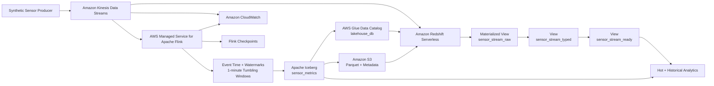

# Real-Time Data Platform on AWS

End-to-end Data Engineering platform for real-time event ingestion, stateful stream processing, Lakehouse storage and low-latency analytics on AWS.

The infrastructure is provisioned with Terraform and implements two parallel analytical paths from the same Amazon Kinesis Data Stream:

- **Hot path:** Kinesis → Redshift Streaming Ingestion → low-latency analytical views.
- **Historical path:** Kinesis → Apache Flink → Apache Iceberg → Amazon S3 / AWS Glue → Redshift Spectrum.

The project combines Infrastructure as Code, stream processing, Event Time, Watermarks, state management, Iceberg tables, observability and analytical consumption in a reproducible cloud environment.

> The project originated during my Data Engineering training and was later consolidated, extended and documented as a portfolio project.

---

## Architecture



---

## Main capabilities

- Real-time event ingestion with Amazon Kinesis Data Streams.
- Stateful stream processing with Apache Flink.
- Event Time processing with Watermarks and idleness detection.
- One-minute Tumbling Event Time Windows.
- Stateful recovery through Flink checkpoints.
- Lakehouse storage using Apache Iceberg.
- Parquet data and Iceberg metadata stored in Amazon S3.
- Metadata management through AWS Glue Data Catalog.
- Direct Kinesis ingestion into Amazon Redshift Serverless.
- Low-latency SQL transformation layer in Redshift.
- Historical analytics through Redshift Spectrum.
- Hot + historical data joins.
- Infrastructure provisioning with reusable Terraform modules.
- Remote Terraform state using S3 and DynamoDB locking.
- Private networking and scoped IAM policies.
- CloudWatch metrics and streaming observability.
- Controlled infrastructure lifecycle with `plan`, `apply` and `destroy`.

---

## Technology stack

| Area | Technologies |
|---|---|
| Cloud | AWS |
| Infrastructure as Code | Terraform |
| Streaming ingestion | Amazon Kinesis Data Streams, Amazon Data Firehose |
| Stream processing | Apache Flink |
| Lakehouse | Apache Iceberg |
| Object storage | Amazon S3 |
| Data catalog | AWS Glue Data Catalog |
| Analytics | Amazon Redshift Serverless, Redshift Spectrum |
| Monitoring | Amazon CloudWatch |
| Languages | Java, Python, SQL, PowerShell |
| Build | Apache Maven |
| Local distributed processing | Apache Kafka, Apache Spark |
| Containers / orchestration | Docker, Kubernetes, Minikube |
| Version control | Git, GitHub |

---

# Data flow

## Hot path

The hot path is designed for low-latency access to recent events.

```text
Synthetic Producer
        |
        v
Amazon Kinesis Data Streams
        |
        v
Redshift Streaming Ingestion
        |
        v
sensor_stream_raw
Materialized View
AUTO REFRESH
        |
        v
sensor_stream_typed
        |
        v
sensor_stream_ready
        |
        v
Low-latency analytics
```

`sensor_stream_raw` consumes directly from Kinesis using Redshift Streaming Ingestion.

The event payload is validated before parsing:

```sql
CASE
    WHEN CAN_JSON_PARSE(kinesis_data)
    THEN JSON_PARSE(kinesis_data)
    ELSE NULL
END AS payload
```

Invalid payloads remain observable through the ingestion layer rather than silently failing.

The next transformation layers expose typed analytical fields such as:

```text
arrival_timestamp
sensor_id
event_timestamp
temperature
humidity
air_quality_index
```

The final event timestamp is safely converted with:

```sql
TRY_CAST(event_timestamp_raw AS TIMESTAMPTZ)
```

The raw streaming Materialized View uses:

```sql
AUTO REFRESH YES
```

while `sensor_stream_typed` and `sensor_stream_ready` are conventional SQL Views.

---

## Historical path

The historical path performs stateful aggregation and stores the resulting analytical data in an Iceberg Lakehouse.

```text
Amazon Kinesis Data Streams
        |
        v
Apache Flink
        |
        v
Event Time + Watermarks
        |
        v
1-minute Tumbling Windows
        |
        v
Apache Iceberg
        |
        +-------------------+
        |                   |
        v                   v
    Amazon S3          AWS Glue
 Parquet + metadata    Data Catalog
        |                   |
        +---------+---------+
                  |
                  v
          Redshift Spectrum
```

The main Iceberg table is:

```text
lakehouse_db.sensor_metrics
```

Its analytical fields include:

```text
sensor_id
window_start
window_end
event_count
avg_temperature
avg_humidity
avg_aqi
```

The table uses Iceberg format v2 and is partitioned using the day derived from `window_start`.

---

# Stream processing design

## Event Time and Watermarks

The Flink application uses the timestamp contained inside each sensor event as Event Time.

Configured out-of-order tolerance:

```text
10 seconds
```

Source idleness detection:

```text
30 seconds
```

Idleness detection prevents an inactive Kinesis partition from indefinitely blocking the global watermark.

Events are grouped by:

```text
sensor_id
```

and processed through:

```text
1-minute Tumbling Event Time Windows
```

This allows aggregations to represent event-time behavior rather than machine processing time.

---

## Checkpoints and state recovery

Flink checkpointing is configured with:

```text
Checkpoint interval: 60000 ms
Minimum pause:       5000 ms
```

Checkpoints preserve a consistent snapshot of stateful operators.

If the application is interrupted, processing can resume from a completed checkpoint instead of rebuilding state from the beginning.

This is particularly important for Event Time windows and the Iceberg sink.

Iceberg commits are coordinated with Flink checkpoints, preventing partially committed analytical updates from becoming visible.

---

## Exactly-once and duplicates

Infrastructure-level consistency and business-level deduplication are different concerns.

The historical path coordinates Flink checkpoint state with Iceberg commits to provide exactly-once semantics for table writes.

The hot path retains Kinesis metadata such as:

```text
partition_key
shard_id
sequence_number
arrival_timestamp
```

These values provide traceability for records consumed through Redshift Streaming Ingestion.

However, if a producer intentionally publishes the same logical event twice as two different Kinesis records, both records are valid from the infrastructure perspective.

A production-grade business deduplication strategy could introduce:

```text
event_id
```

and explicitly deduplicate using that identifier.

---

# Redshift analytical layer

Redshift Serverless provides the low-latency analytical layer.

The main streaming flow is:

```text
Kinesis
   |
   v
sensor_stream_raw
   |
   v
sensor_stream_typed
   |
   v
sensor_stream_ready
```

The streaming source is exposed through an External Schema:

```sql
CREATE EXTERNAL SCHEMA kinesis_stream
FROM KINESIS
IAM_ROLE default;
```

The historical Iceberg catalog is exposed separately through Glue:

```sql
CREATE EXTERNAL SCHEMA lakehouse_ext
FROM DATA CATALOG
DATABASE 'lakehouse_db'
REGION 'us-east-1'
IAM_ROLE default;
```

This allows Redshift to query:

```text
lakehouse_ext.sensor_metrics
```

and combine recent events with historical aggregates in the same analytical query.

---

## Freshness strategy

The target policy defined for the hot path is:

```text
Target freshness: <= 60 seconds
Warning:          > 90 seconds
Critical:         > 120 seconds sustained for 5 minutes
```

Relevant signals include:

- `SYS_STREAM_SCAN_STATES`
- `skipped_rows`
- Kinesis `IteratorAgeMilliseconds`
- Kinesis shard throughput
- Redshift Serverless capacity
- Redshift workload
- Flink processing behavior

---

# Backpressure and saturation

Amazon Kinesis acts as a durable buffer between producers and downstream consumers.

If a consumer cannot keep up with incoming events, records remain temporarily available in Kinesis while consumer lag increases.

For Kinesis, a key metric is:

```text
IteratorAgeMilliseconds
```

Within Flink, slow sinks or saturated operators can propagate backpressure upstream and reduce the rate at which the application consumes new records.

Relevant diagnostic signals include:

- Kinesis Iterator Age.
- Shard throughput.
- Flink checkpoint duration.
- Failed checkpoints.
- Flink operator backpressure.
- Redshift `SYS_STREAM_SCAN_STATES`.
- Redshift `skipped_rows`.
- Streaming freshness.
- Redshift Serverless RPU utilization.

Depending on the bottleneck, mitigation can include:

```text
Kinesis  -> increase shard capacity
Flink    -> adjust parallelism / inspect operators and sinks
Redshift -> review workload or increase Serverless capacity
```

---

# Security

## AWS networking

The cloud environment uses:

- Dedicated VPC.
- Private subnets.
- Private Redshift Serverless deployment.
- S3 Gateway VPC Endpoint.
- Kinesis Interface VPC Endpoint.
- Security Groups.
- Public access disabled for Redshift.

---

## IAM

The Flink and Redshift roles follow scoped-access principles.

Flink receives the permissions necessary to:

- Read its JAR from S3.
- Consume the Kinesis stream.
- Read and write the Lakehouse bucket.
- Access the required Glue database and tables.
- Publish logs to CloudWatch.

Redshift receives permissions to:

- Consume Kinesis.
- Query AWS Glue Data Catalog.
- Read Iceberg objects from S3.
- Use KMS where required by Kinesis access.

Resource ARNs are generated dynamically.

The AWS account ID is obtained using:

```hcl
data "aws_caller_identity" "current" {}
```

instead of being hardcoded.

Operations that require AWS-wide `Describe` or `List` permissions may use:

```text
Resource = "*"
```

while data-access permissions remain scoped to project resources.

---

## Redshift access

The SQL layer defines an analytical role:

```text
analytics_reader
```

with read-oriented permissions for the analytical schemas and views.

It does not receive infrastructure administration privileges.

---

# Infrastructure as Code

Terraform manages the infrastructure through reusable modules.

The environment composition root connects:

```text
network
identity
kinesis
lakehouse
flink
redshift
```

Dependencies are passed through Terraform variables and outputs.

Examples:

```text
Kinesis Stream ARN    -> Flink
Kinesis Stream ARN    -> Redshift
Lakehouse Bucket ARN  -> Flink
Lakehouse Bucket ARN  -> Redshift
Glue Database         -> Flink
Glue Database         -> Redshift
VPC / Subnets         -> Redshift
```

---

## Remote state

Terraform state is stored remotely using:

```text
Amazon S3
```

with locking provided by:

```text
Amazon DynamoDB
```

The bootstrap stack is intentionally separated from the main environment because the remote backend must exist before the primary infrastructure can initialize against it.

---

## Terraform modules

### `terraform/modules/network`

Manages:

- VPC.
- Private subnets.
- Availability Zones.
- Route tables.
- Route associations.
- S3 Gateway Endpoint.
- DNS support.

### `terraform/modules/identity`

Manages project IAM roles and policies.

### `terraform/modules/kinesis`

Manages:

- Kinesis Data Stream.
- Amazon Data Firehose.
- IAM permissions.
- CloudWatch resources.
- Raw/Bronze delivery.

### `terraform/modules/flink`

Manages:

- JAR artifact bucket.
- Flink application artifact.
- AWS Managed Service for Apache Flink.
- CloudWatch Logs.
- IAM.
- Runtime properties.
- Checkpoint configuration.
- Parallelism.
- Application startup.

### `terraform/modules/lakehouse`

Manages:

- S3 Lakehouse bucket.
- Versioning.
- Encryption.
- Public Access Block.
- AWS Glue database.
- Iceberg warehouse path.

### `terraform/modules/redshift`

Manages:

- Redshift IAM role.
- Security Groups.
- Kinesis VPC Endpoint.
- Redshift Serverless Namespace.
- Redshift Serverless Workgroup.
- Compute usage limits.

---

# Key development parameters

The development environment uses explicit configuration for the main streaming components.

| Parameter | Value |
|---|---:|
| AWS Region | `us-east-1` |
| Kinesis shards | `2` |
| Flink runtime | `FLINK-1_20` |
| Flink parallelism | `1` |
| Parallelism per KPU | `1` |
| Flink autoscaling | Disabled |
| Checkpoint interval | `60000 ms` |
| Minimum checkpoint pause | `5000 ms` |
| Watermark out-of-orderness | `10 seconds` |
| Source idleness | `30 seconds` |
| Window size | `1 minute` |
| Redshift Serverless base capacity | `4 RPU` |
| Redshift Serverless max capacity | `4 RPU` |
| Redshift public access | Disabled |

These values are exposed through Terraform variables instead of being tightly coupled to module implementation.

---

# End-to-end validation

A documented end-to-end validation deployed the complete environment and tested both analytical paths using synthetic sensor events.

Infrastructure state:

```text
48 resources created
Kinesis:          ACTIVE
Redshift:         AVAILABLE
Flink:            RUNNING
```

Test workload:

```text
100 events
5 sensors
```

Hot path result:

```text
Redshift events: 100
Sensors:           5
```

Historical path result:

```text
Iceberg windows: 15
Aggregated events: 100
Sensors:             5
```

The historical validation also confirmed:

- Parquet files.
- Iceberg metadata.
- Manifests.
- Snapshots.
- `lakehouse_db.sensor_metrics` in AWS Glue.

Cross-path consistency:

```text
Windows compared:  15
Redshift events:   100
Iceberg events:    100
Count differences:   0
```

Observed differences in averages were limited to floating-point precision.

Streaming observability during the test recorded:

```text
Kinesis IteratorAgeMilliseconds: 0
Flink failed checkpoints:        0
Checkpoint duration:             ~190-363 ms
```

Additional details are documented in:

```text
docs/e2e-validation.md
```

---

# Local Kafka and Spark environment

The repository also contains a local distributed-processing environment used to experiment with streaming concepts independently from the AWS architecture.

It includes:

```text
Python Producer
      |
      v
Apache Kafka
urban_sensors
      |
      v
Apache Spark
Structured Streaming
      |
      v
1-minute windows
```

Kubernetes manifests are located in:

```text
k8s/
```

and the Spark job in:

```text
spark/streaming_job.py
```

This environment is complementary to the main AWS pipeline and is not part of the production-style cloud data path described above.

---

# Repository structure

```text
Realtime-data-platform-aws/
|
|-- README.md
|-- .gitignore
|-- .gitattributes
|
|-- docs/
|   |-- e2e-validation.md
|   |-- final-*.png
|   `-- evidencia-*.png
|
|-- flink-app/
|   |-- pom.xml
|   `-- src/main/java/com/dataops/flink/
|       `-- SensorStreamingJob.java
|
|-- producer/
|   `-- producer.py
|
|-- scripts/
|   |-- render_redshift_sql.py
|   |-- send_sensor_events.ps1
|   `-- send_test_events.ps1
|
|-- sql/
|   `-- streaming_ingestion.sql
|
|-- spark/
|   `-- streaming_job.py
|
|-- k8s/
|   |-- namespace.yaml
|   |-- kafka-configmap.yaml
|   |-- kafka-deployment.yaml
|   |-- kafka-service.yaml
|   |-- spark-configmap.yaml
|   |-- spark-deployment.yaml
|   `-- spark-job-configmap.yaml
|
`-- terraform/
    |-- bootstrap/
    |
    |-- environments/
    |   `-- dev/
    |       |-- backend.hcl.example
    |       |-- backend.tf
    |       |-- main.tf
    |       |-- outputs.tf
    |       |-- provider.tf
    |       |-- terraform.tfvars.example
    |       `-- variables.tf
    |
    `-- modules/
        |-- network/
        |-- identity/
        |-- kinesis/
        |-- flink/
        |-- lakehouse/
        `-- redshift/
```

Generated infrastructure state, local configuration and build artifacts are excluded from Git.

---

# Running the project

## Requirements

The full environment was developed using:

- Git.
- Terraform.
- AWS CLI.
- Python.
- Java 17.
- Apache Maven.
- PowerShell.
- Docker Desktop.
- kubectl.
- Minikube.

Valid AWS credentials must be configured locally.

Credentials must never be stored inside the repository.

---

## 1. Clone the repository

```powershell
git clone https://github.com/MarcosPim-web/Realtime-data-platform-aws.git
cd Realtime-data-platform-aws
```

---

## 2. Create the Terraform backend

```powershell
cd terraform\bootstrap

terraform init
terraform validate
terraform plan
terraform apply
```

The bootstrap stack creates the resources required for the remote Terraform backend.

After creation:

```powershell
cd ..\..
```

---

## 3. Build the Flink application

```powershell
cd flink-app
mvn clean package
cd ..
```

The generated application artifact is:

```text
flink-app/target/realtime-flink-processing-1.0.0.jar
```

Terraform uploads this artifact to S3 when deploying the Managed Flink application.

---

## 4. Configure the development environment

```powershell
cd terraform\environments\dev

Copy-Item terraform.tfvars.example terraform.tfvars
Copy-Item backend.hcl.example backend.hcl
```

Update the environment-specific values before deployment.

Example configuration:

```hcl
region                                  = "us-east-1"
project_name                            = "realtime-data-platform"
environment                             = "dev"
vpc_cidr                                = "10.0.0.0/16"
bucket_name                             = "CHANGE-ME-unique-raw-bucket"
bucket_prefix                           = "raw/"

kinesis_shard_count                     = 2

flink_start_application                 = true
flink_checkpoint_interval_ms            = 60000
flink_min_pause_between_checkpoints_ms  = 5000
flink_parallelism                       = 1
flink_parallelism_per_kpu               = 1

glue_database_name                      = "lakehouse_db"
redshift_database_name                  = "analytics"
```

The S3 bucket name must be globally unique.

---

## 5. Configure the remote backend

Example `backend.hcl`:

```hcl
bucket         = "CHANGE-ME-terraform-state-bucket"
key            = "environments/dev/terraform.tfstate"
region         = "us-east-1"
dynamodb_table = "CHANGE-ME-terraform-lock-table"
encrypt        = true
```

`backend.hcl` is intentionally excluded from Git.

Initialize Terraform:

```powershell
terraform init -reconfigure -backend-config="backend.hcl"
terraform validate
terraform plan
```

---

## 6. Deploy the environment

```powershell
terraform apply
```

With:

```hcl
flink_start_application = true
```

Terraform requests the Flink application startup as part of the infrastructure deployment.

Expected service states:

```text
Kinesis:          ACTIVE
Redshift:         AVAILABLE
Managed Flink:    RUNNING
```

---

# Redshift SQL deployment

The version-controlled SQL template is:

```text
sql/streaming_ingestion.sql
```

Environment-specific values are rendered automatically from:

```text
terraform/environments/dev/terraform.tfvars
```

From the repository root:

```powershell
python .\scripts\render_redshift_sql.py
```

This generates:

```text
sql/streaming_ingestion.rendered.sql
```

The rendered file contains environment-specific values and is excluded from Git.

The SQL setup includes:

- Kinesis External Schema.
- `sensor_stream_raw`.
- Automatic streaming refresh.
- JSON validation and parsing.
- `sensor_stream_typed`.
- `sensor_stream_ready`.
- Glue External Schema.
- Iceberg queries.
- Hot + historical JOIN.
- Streaming monitoring queries.
- `analytics_reader`.
- SQL grants.

---

# Sending synthetic events

The repository includes PowerShell scripts for sending synthetic sensor events to Kinesis.

Default test:

```powershell
.\scripts\send_test_events.ps1
```

The default workload generates:

```text
100 events
5 sensors
```

A custom stream name or event count can also be provided:

```powershell
.\scripts\send_test_events.ps1 `
    -StreamName "realtime-data-platform-dev-stream" `
    -RecordCount 100
```

Example event:

```json
{
  "sensor_id": "sensor-01",
  "temperature": 24.5,
  "humidity": 61.8,
  "air_quality_index": 74,
  "timestamp": "2026-08-27T18:30:00.0000000Z"
}
```

---

# Observability

## Kinesis

Main signals:

```text
IteratorAgeMilliseconds
Read / Write throughput
Shard-level behavior
```

---

## Apache Flink

Monitored signals include:

- Application status.
- Completed checkpoints.
- Failed checkpoints.
- Checkpoint duration.
- Operator backpressure.
- Exceptions.
- CloudWatch Logs.

---

## Redshift

Streaming state can be inspected through:

```text
SYS_STREAM_SCAN_STATES
```

Useful information includes:

- Rows processed.
- Rows skipped.
- Last record timestamp.
- Scan timestamp.
- Streaming lag.

---

# Selected evidence

## Managed Apache Flink running


## Flink checkpoints


## Flink monitoring


## Kinesis monitoring


## Redshift hot path


## Redshift and Iceberg integration


Additional implementation and validation screenshots are available in:

```text
docs/
```

---

# Code validation

## Terraform formatting

From the repository root:

```powershell
terraform fmt -recursive
terraform fmt -check -recursive
```

## Bootstrap validation

```powershell
terraform "-chdir=terraform/bootstrap" validate
```

## Development environment

After backend initialization:

```powershell
terraform "-chdir=terraform/environments/dev" validate
```

## Flink application

```powershell
cd flink-app
mvn clean package
cd ..
```

## Git checks

```powershell
git status
git diff --check
```

---

# Cost management

The project uses managed AWS resources that may generate costs while running.

The development environment therefore uses:

- Limited Kinesis shard count.
- Controlled Flink parallelism.
- 60-second checkpoints.
- Redshift Serverless capacity limits.
- Daily Redshift compute limits.
- Private infrastructure.
- Terraform-managed destruction after testing.

Resources can be removed with:

```powershell
cd terraform\environments\dev
terraform destroy
```

The Terraform backend remains separate so that state infrastructure can be managed independently.

---

# Git and security hygiene

The repository excludes local and sensitive files such as:

```text
.terraform/
.venv/
*.tfstate
*.tfstate.*
*.tfvars
*.tfvars.json
backend.hcl
flink-app/target/
```

Example configuration files remain versioned:

```text
terraform.tfvars.example
backend.hcl.example
```

This keeps the project reproducible without publishing environment-specific configuration, Terraform state or credentials.

The `.terraform.lock.hcl` files remain version-controlled to preserve provider consistency.

---

# Project background

This platform was originally developed while completing a Data Engineering training program.

The project was progressively expanded into an end-to-end architecture covering:

```text
Infrastructure as Code
Real-time ingestion
Distributed processing
Stateful stream processing
Lakehouse architecture
Low-latency analytics
Observability
Security
Infrastructure lifecycle
```

The final repository is maintained as a technical portfolio project focused on demonstrating practical Data Engineering concepts using AWS, Terraform and open-source streaming technologies.

---

## Author

**Marcos Rafael Insfrán**
GitHub: `MarcosPim-web`

Data Engineering · Real-Time Processing · Infrastructure as Code · Data Pipelines