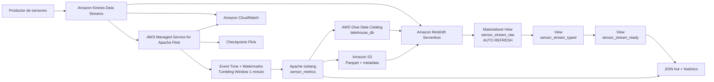

# Infraestructura de datos en AWS con Terraform

Este repositorio contiene el proyecto Capstone desarrollado a partir de las preentregas 1, 2, 3, 4, 5 y 6 del curso de Data Engineering.

Las distintas etapas fueron integradas progresivamente hasta conformar una plataforma de datos validada de extremo a extremo, combinando infraestructura como código, ingesta en tiempo real, procesamiento distribuido y stateful, arquitectura Lakehouse y una capa analítica de baja latencia.

La infraestructura principal se administra mediante Terraform y utiliza servicios de AWS como Amazon Kinesis Data Streams, Amazon Data Firehose, AWS Managed Service for Apache Flink, Amazon S3, AWS Glue Data Catalog, Apache Iceberg y Amazon Redshift Serverless.

El Capstone final utiliza dos caminos analíticos paralelos a partir del mismo stream de Kinesis:

- **Hot path:** Kinesis → Redshift Streaming Ingestion → `sensor_stream_raw` → `sensor_stream_typed` → `sensor_stream_ready`.
- **Historical path:** Kinesis → Apache Flink → Apache Iceberg → Amazon S3 / AWS Glue → Redshift Spectrum.

Esta separación permite combinar baja latencia para eventos recientes con almacenamiento histórico consistente y consultable.

---

## Arquitectura final



---

## Parámetros críticos

La configuración utilizada por el entorno de desarrollo define explícitamente los parámetros principales de procesamiento.

| Parámetro | Valor |
|---|---:|
| Región AWS | `us-east-1` |
| Kinesis shards | `2` |
| Kinesis retention | configuración estándar del stream |
| Flink runtime | `FLINK-1_20` |
| Flink parallelism | `1` |
| Parallelism per KPU | `1` |
| Auto Scaling Flink | deshabilitado |
| Checkpoint interval | `60000 ms` |
| Minimum pause between checkpoints | `5000 ms` |
| Watermark out-of-orderness | `10 segundos` |
| Source idleness | `30 segundos` |
| Window | `1 minuto` |
| Redshift Serverless base capacity | `4 RPU` |
| Redshift Serverless max capacity | `4 RPU` |
| Redshift public access | deshabilitado |

Los valores críticos de Kinesis y Flink se reciben mediante variables del entorno de Terraform en lugar de quedar acoplados al módulo.

---

# Recursos implementados

## Preentrega 1: infraestructura base

La primera etapa creó la infraestructura base necesaria para desplegar posteriormente los servicios de procesamiento.

Se implementaron:

- Backend remoto de Terraform en Amazon S3.
- Tabla de DynamoDB para bloqueo del estado.
- VPC dedicada para la plataforma.
- Subredes privadas distribuidas en distintas Availability Zones.
- Tabla de rutas.
- Gateway Endpoint para Amazon S3.
- Roles y políticas IAM.
- Rol IAM de auditoría de solo lectura.
- Separación entre bootstrap y entorno principal.

El backend se mantiene separado del entorno de desarrollo porque debe existir antes de inicializar el state remoto del resto de la infraestructura.

---

## Preentrega 2: ingesta en tiempo real

La segunda etapa incorporó el primer flujo de ingesta de eventos.

Se implementaron:

- Amazon Kinesis Data Stream.
- Amazon Data Firehose.
- Entrega de eventos hacia Amazon S3.
- Roles y políticas IAM para Firehose.
- Alarmas de Amazon CloudWatch.
- Script PowerShell para generación de eventos.
- Validación de archivos almacenados en la capa Raw/Bronze.

El flujo correspondiente a esta etapa es:

```text
Producer
   |
   v
Amazon Kinesis Data Streams
   |
   v
Amazon Data Firehose
   |
   v
Amazon S3
Raw / Bronze
```

---

## Preentrega 3: procesamiento distribuido

La tercera etapa incorporó un entorno local de procesamiento distribuido basado en Kubernetes.

Se implementaron:

- Namespace `urban-data`.
- Apache Kafka mediante Kubernetes Deployment y Service.
- Configuración de Kafka mediante ConfigMap.
- Tópico `urban_sensors`.
- 3 particiones.
- Productor Python.
- Apache Spark Structured Streaming.
- Configuración de Spark mediante ConfigMap.
- Job de Spark montado automáticamente.
- Ventanas de procesamiento de 1 minuto.
- Agregaciones por `sensor_id`.

El flujo local utilizado fue:

```text
Producer Python
       |
       v
Apache Kafka
urban_sensors
       |
       v
Apache Spark
Structured Streaming
       |
       v
Window 1 minuto
       |
       v
AVG temperature
AVG air_quality_index
```

Los manifiestos se encuentran dentro de:

```text
k8s/
```

y el job de Spark en:

```text
spark/streaming_job.py
```

---

## Preentrega 4: procesamiento stateful con Apache Flink

La cuarta etapa trasladó el procesamiento en tiempo real hacia AWS Managed Service for Apache Flink.

Se implementaron:

- AWS Managed Service for Apache Flink.
- Apache Flink 1.20.
- Aplicación Java empaquetada mediante Maven.
- Consumo desde Kinesis Data Streams.
- Parseo de eventos JSON.
- Event Time.
- Watermarks.
- Idleness detection.
- Agrupación por `sensor_id`.
- Tumbling Event Time Windows.
- Procesamiento stateful.
- Checkpoints automáticos.
- CloudWatch Logs.
- Bucket S3 para el artefacto JAR.
- IAM específico para Flink.

### Event Time y Watermarks

Después de deserializar cada evento, la aplicación utiliza el timestamp incluido en el payload como Event Time.

La estrategia configurada permite hasta:

```text
10 segundos
```

de eventos fuera de orden.

También se utiliza:

```text
Idleness: 30 segundos
```

para evitar que una partición temporalmente inactiva impida el avance global del watermark.

El procesamiento se organiza mediante:

```text
keyBy(sensor_id)
```

y ventanas:

```text
Tumbling Event Time Window
1 minuto
```

### Checkpoints

La configuración utiliza:

```text
Checkpoint interval: 60000 ms
Minimum pause: 5000 ms
Checkpointing: enabled
```

Durante las pruebas se observaron múltiples checkpoints completados correctamente.

Los checkpoints permiten recuperar el estado del job ante fallos y son además utilizados para coordinar los commits realizados por Apache Iceberg.

### Aplicación Flink

La aplicación se encuentra en:

```text
flink-app/src/main/java/com/dataops/flink/SensorStreamingJob.java
```

El proyecto Maven se encuentra en:

```text
flink-app/pom.xml
```

Para compilar:

```powershell
cd flink
mvn clean package
cd ..
```

Terraform utiliza el artefacto:

```text
flink-app/target/realtime-flink-processing-1.0.0.jar
```

El objeto almacenado en S3 utiliza un hash derivado del archivo para permitir que Terraform detecte modificaciones en el artefacto.

### Arranque mediante Terraform

El comportamiento de arranque de la aplicación se controla mediante:

```hcl
flink_start_application = true
```

Para la validación final se utiliza `true`.

De esta manera, `terraform apply` crea la aplicación y solicita su inicio como parte del despliegue declarativo, sin requerir ejecutar manualmente `aws kinesisanalyticsv2 start-application`.

Durante la ejecución el estado esperado es:

```text
RUNNING
```

---

## Preentrega 5: Lakehouse con Apache Iceberg

La quinta etapa incorporó una capa Lakehouse.

Se implementaron:

- Bucket S3 dedicado al warehouse.
- Cifrado AES256.
- Versionado del bucket.
- AWS Glue Data Catalog.
- Base de datos `lakehouse_db`.
- Apache Iceberg.
- Tabla `sensor_metrics`.
- Apache Flink Iceberg Sink.
- Archivos Parquet.
- Metadata Iceberg.
- Manifests.
- Snapshots.
- Particionamiento por día.
- Integración con Amazon Athena.

El flujo implementado es:

```text
Kinesis
   |
   v
Apache Flink
   |
   v
Event Time + Watermarks
   |
   v
Window 1 minuto
   |
   v
IcebergSink
   |
   v
Apache Iceberg
   |
   +------------------+
   |                  |
   v                  v
Amazon S3         AWS Glue
Parquet           Data Catalog
Metadata               |
   |                    v
   +--------------> Amazon Athena
```

### Tabla Iceberg

La tabla utilizada es:

```text
lakehouse_db.sensor_metrics
```

Los campos principales son:

```text
sensor_id
window_start
window_end
event_count
avg_temperature
avg_humidity
avg_aqi
```

La tabla utiliza formato Iceberg v2 y se encuentra particionada utilizando el día correspondiente a `window_start`.

### Checkpoints y commits Iceberg

La escritura hacia Apache Iceberg está coordinada con los checkpoints de Flink.

El sink utilizado es:

```java
IcebergSink
    .forRow(...)
    .tableLoader(...)
    .append();
```

Los commits visibles de la tabla se coordinan con checkpoints completados correctamente.

Durante las pruebas se verificaron componentes como:

```text
IcebergWriteAggregator
IcebergCommitter
```

y se validó la existencia de:

- Archivos Parquet.
- Metadata.
- Manifests.
- Snapshots.

---

## Preentrega 6: Redshift Streaming Ingestion

La sexta etapa incorporó Amazon Redshift Serverless como capa analítica de baja latencia.

Se implementaron:

- Amazon Redshift Serverless.
- Namespace `realtime-data-platform-dev`.
- Workgroup `realtime-data-platform-dev-wg`.
- Capacidad base de 4 RPU.
- Capacidad máxima de 4 RPU.
- Límite diario de compute.
- Subredes privadas.
- Security Groups.
- Interface VPC Endpoint para Kinesis.
- Rol IAM específico para Redshift.
- Streaming Ingestion desde Kinesis.
- Integración con Glue e Iceberg.
- JOIN entre información hot e histórica.
- Monitoreo mediante `SYS_STREAM_SCAN_STATES`.
- Rol SQL `analytics_reader`.

El camino hot final es:

```text
Amazon Kinesis Data Streams
             |
             v
Redshift Streaming Ingestion
             |
             v
sensor_stream_raw
Materialized View
AUTO REFRESH
             |
             v
sensor_stream_typed
View
             |
             v
sensor_stream_ready
View
```

En paralelo:

```text
Kinesis
   |
   v
Flink
   |
   v
Apache Iceberg
   |
   +---- Amazon S3
   |
   +---- AWS Glue Data Catalog
              |
              v
     Redshift External Schema
              |
              v
     lakehouse_ext.sensor_metrics
```

Finalmente:

```text
sensor_stream_ready
        |
        +------ JOIN por sensor_id ------+
                                        |
                                        v
                         lakehouse_ext.sensor_metrics
```

---

# Modelado de Redshift Streaming Ingestion

## External Schema de Kinesis

Redshift se conecta directamente al stream mediante:

```sql
CREATE EXTERNAL SCHEMA kinesis_stream
FROM KINESIS
IAM_ROLE default;
```

Este camino no utiliza S3 como intermediario.

---

## Materialized View raw

La capa de ingesta principal es:

```text
sensor_stream_raw
```

La Materialized View consume directamente:

```text
kinesis_stream."realtime-data-platform-dev-stream"
```

y utiliza:

```sql
AUTO REFRESH YES
```

El payload se valida antes de parsearse:

```sql
CASE
    WHEN CAN_JSON_PARSE(kinesis_data)
    THEN JSON_PARSE(kinesis_data)
    ELSE NULL
END AS payload
```

Los eventos inválidos quedan disponibles mediante:

```text
failed_payload
```

La vista también expone:

```text
arrival_timestamp
partition_key
shard_id
sequence_number
```

`arrival_timestamp` corresponde al timestamp aproximado de llegada del registro a Kinesis y se utiliza en las validaciones de freshness.

---

## Modelado del JSON

Los eventos contienen:

```text
sensor_id
timestamp
temperature
humidity
air_quality_index
```

La View:

```text
sensor_stream_typed
```

extrae los valores desde el objeto `SUPER` y los convierte a tipos SQL.

La capa contiene:

```text
arrival_timestamp
sensor_id
event_timestamp_raw
temperature
humidity
air_quality_index
```

Los tipos principales utilizados son:

```text
sensor_id              VARCHAR
event_timestamp_raw    VARCHAR
temperature            DECIMAL(5,2)
humidity               DECIMAL(5,2)
air_quality_index      INTEGER
```

El timestamp del evento se mantiene inicialmente como `VARCHAR`.

La conversión final ocurre en:

```text
sensor_stream_ready
```

mediante:

```sql
TRY_CAST(event_timestamp_raw AS TIMESTAMPTZ)
```

De esta manera, `sensor_stream_raw` concentra la ingesta incremental desde Kinesis mientras que `sensor_stream_typed` y `sensor_stream_ready` funcionan como capas SQL de transformación sin requerir refresh independiente.

---

## Estrategia de refresh

La configuración final utiliza:

```sql
CREATE MATERIALIZED VIEW sensor_stream_raw
AUTO REFRESH YES
```

Las capas:

```text
sensor_stream_typed
sensor_stream_ready
```

son Views convencionales.

Por lo tanto, la operación normal no requiere ejecutar manualmente múltiples comandos `REFRESH MATERIALIZED VIEW`.

Para una validación controlada todavía puede ejecutarse excepcionalmente:

```sql
REFRESH MATERIALIZED VIEW sensor_stream_raw;
```

pero este comando no forma parte de la operación normal del pipeline final.

### Política de freshness

La política operativa definida para el camino hot es:

```text
Freshness objetivo: <= 60 segundos
Warning:             > 90 segundos
Critical:            > 120 segundos sostenidos durante 5 minutos
```

Ante un aumento del lag se revisan conjuntamente:

- `SYS_STREAM_SCAN_STATES`.
- `skipped_rows`.
- `IteratorAgeMilliseconds`.
- Throughput del Kinesis Data Stream.
- Utilización del workgroup de Redshift.
- Capacidad RPU disponible.

Según el cuello de botella detectado, la respuesta puede incluir:

- Incrementar shards de Kinesis.
- Revisar el procesamiento de Flink.
- Revisar sinks.
- Ajustar paralelismo.
- Ajustar capacidad de Redshift Serverless.
- Revisar carga de consultas.

---

# Integración de Redshift con Apache Iceberg

Redshift utiliza un External Schema conectado con AWS Glue Data Catalog:

```sql
CREATE EXTERNAL SCHEMA lakehouse_ext
FROM DATA CATALOG
DATABASE 'lakehouse_db'
REGION 'us-east-1'
IAM_ROLE default;
```

Esto permite consultar:

```text
lakehouse_ext.sensor_metrics
```

La consulta histórica puede recuperar:

```text
sensor_id
window_start
window_end
event_count
avg_temperature
avg_humidity
avg_aqi
```

Redshift puede combinar esta información con `sensor_stream_ready` para consultar en una misma sentencia el último evento hot y la última ventana histórica de cada sensor.

---

# Seguridad

## IAM

Los roles utilizados por Flink y Redshift siguen el principio de mínimo privilegio.

Flink dispone de permisos para:

- Leer su JAR desde S3.
- Consumir el Kinesis Data Stream.
- Leer y escribir dentro del bucket específico del Lakehouse.
- Consultar y actualizar la base y tablas correspondientes en Glue.
- Publicar logs en CloudWatch.

Redshift dispone de permisos para:

- Consumir el Kinesis Data Stream.
- Consultar AWS Glue Data Catalog.
- Leer objetos del bucket Iceberg.
- Utilizar KMS únicamente en el contexto requerido para consumir Kinesis.

Los permisos que acceden directamente a datos se encuentran restringidos mediante ARNs construidos dinámicamente.

El AWS Account ID se obtiene mediante:

```hcl
data "aws_caller_identity" "current" {}
```

y no se encuentra hardcodeado en Terraform.

Algunas operaciones globales de AWS requieren `Resource = "*"`, entre ellas determinadas operaciones `Describe` y `List`.

Los permisos KMS que utilizan wildcard se encuentran restringidos mediante condiciones de servicio, por ejemplo:

```text
kms:ViaService = kinesis.<region>.amazonaws.com
```

por lo que no representan acceso irrestricto a recursos productivos.

---

## Redshift SQL

Dentro de Redshift se utiliza el rol:

```text
analytics_reader
```

El rol recibe únicamente los permisos necesarios para consumir la capa analítica.

Entre ellos:

```text
USAGE sobre public
SELECT sobre sensor_stream_raw
SELECT sobre sensor_stream_typed
SELECT sobre sensor_stream_ready
USAGE sobre lakehouse_ext
TEMP sobre analytics
```

No recibe permisos administrativos ni permisos para modificar la infraestructura.

---

# Backpressure y saturación

Amazon Kinesis Data Streams funciona como buffer durable entre los productores y los consumidores.

## Redshift

Redshift consume los registros almacenados en Kinesis mediante `sensor_stream_raw`.

Si Redshift no logra consumir al mismo ritmo al que se generan nuevos eventos, los registros permanecen temporalmente en Kinesis y aumenta el lag entre producción y consumo.

Este comportamiento puede detectarse mediante:

```text
SYS_STREAM_SCAN_STATES
```

y las métricas de Kinesis.

Un incremento sostenido de lag indica que el consumidor no está alcanzando la velocidad de producción.

## Apache Flink

Dentro de Flink, un sink lento o un operador saturado puede generar backpressure.

El backpressure reduce progresivamente la velocidad con la que los operadores anteriores pueden producir datos.

Si Flink deja de consumir Kinesis a la velocidad necesaria, esta situación termina reflejándose en:

```text
IteratorAgeMilliseconds
```

## Diagnóstico

Para identificar el cuello de botella se monitorean conjuntamente:

- Iterator Age de Kinesis.
- Throughput de shards.
- Checkpoints de Flink.
- Duración de checkpoints.
- Failed checkpoints.
- Backpressure de operadores Flink.
- Utilización de operadores.
- `SYS_STREAM_SCAN_STATES`.
- `skipped_rows`.
- Freshness de Redshift.
- Utilización de RPU de Redshift Serverless.

## Respuesta

Si el cuello de botella está en Kinesis:

- Aumentar el número de shards.

Si está en Flink:

- Revisar paralelismo.
- Revisar operadores.
- Revisar comportamiento del Iceberg Sink.

Si está en Redshift:

- Revisar capacidad del workgroup.
- Revisar carga analítica.
- Evaluar aumento de capacidad.

---

# Recuperación de estado de Apache Flink

La aplicación utiliza checkpoints automáticos cada:

```text
60 segundos
```

Los checkpoints contienen un estado consistente de los operadores y permiten restaurar la ejecución después de una interrupción.

Ante una falla, la aplicación puede recuperar el último checkpoint completado correctamente y continuar el procesamiento desde ese estado consistente en lugar de comenzar nuevamente desde cero.

Esto protege especialmente los operadores stateful utilizados para las ventanas de Event Time.

La escritura hacia Apache Iceberg está coordinada con los checkpoints de Flink.

Los cambios se vuelven visibles mediante commits de Iceberg cuando el checkpoint correspondiente se completa correctamente.

Una interrupción ocurrida antes del commit no debería producir una actualización parcial visible en la tabla analítica.

---

# Exactly-once, idempotencia y duplicados

Los dos caminos principales utilizan mecanismos diferentes para proteger la consistencia.

## Hot path

Redshift Streaming Ingestion identifica los registros provenientes de Kinesis mediante información asociada al stream, shard y sequence number.

Esto permite procesar cada registro consumido por la ingesta de streaming una única vez.

## Historical path

Apache Flink mantiene su estado mediante checkpoints.

El Iceberg Sink coordina sus commits con esos checkpoints para proporcionar semántica exactly-once sobre la tabla.

Esto protege el pipeline frente a duplicados generados por reintentos internos o recuperación del procesamiento.

## Duplicados de negocio

Exactly-once de infraestructura no equivale a deduplicación de negocio.

Si el productor publica dos veces el mismo evento lógico como dos registros diferentes de Kinesis, ambos registros poseen identificadores distintos y pueden ser procesados legítimamente.

En un escenario productivo donde este caso deba evitarse, cada evento debería incorporar:

```text
event_id
```

y la capa de procesamiento debería implementar una política explícita de deduplicación.

---

# Observabilidad

La arquitectura combina métricas de Kinesis, Flink y Redshift.

## Kinesis

La principal señal utilizada es:

```text
IteratorAgeMilliseconds
```

Un valor creciente puede indicar que algún consumidor se está retrasando.

## Flink

Se monitorean:

- Checkpoints completados.
- Checkpoints fallidos.
- Duración.
- Backpressure.
- Logs de CloudWatch.
- Estado de la aplicación.

Durante la última validación E2E registrada se observó:

```text
numberOfFailedCheckpoints = 0
Checkpoint duration ≈ 190-363 ms
```

## Redshift

La vista utilizada es:

```text
SYS_STREAM_SCAN_STATES
```

La consulta permite observar por shard:

- Filas procesadas.
- Filas omitidas.
- Timestamp del último registro.
- Timestamp del scan.
- Lag calculado.

El objetivo final es obtener una evidencia con `arrival_timestamp` actualizado y medir la freshness bajo la configuración de auto-refresh.

---

# Validación End-to-End registrada

La validación E2E documentada el 27 de agosto de 2026 desplegó el entorno completo y verificó los dos caminos del pipeline.

## Infraestructura

Resultado de Terraform:

```text
48 resources created
0 modified
0 destroyed
```

Servicios:

```text
Kinesis: ACTIVE
Redshift Serverless: AVAILABLE
Flink: RUNNING
```

## Eventos enviados

Se generaron:

```text
100 eventos
5 sensores
```

## Camino hot

Redshift observó:

```text
100 eventos
5 sensores
```

## Camino histórico

Flink procesó los mismos eventos utilizando:

- Event Time.
- Watermarks.
- Ventanas de 1 minuto.

Iceberg produjo:

```text
15 ventanas
100 eventos agregados
5 sensores
```

También se verificaron:

- Archivos Parquet.
- Metadata Iceberg.
- Manifests.
- Snapshots.
- Tabla `lakehouse_db.sensor_metrics` en Glue.

## Consistencia

La comparación Redshift vs Iceberg obtuvo:

```text
Ventanas comparadas:      15
Eventos Redshift:        100
Eventos Iceberg:         100
Diferencias de conteo:     0
```

Las diferencias observadas en promedios correspondieron únicamente a precisión de punto flotante.

## Observabilidad de la prueba

Se registró:

```text
Kinesis IteratorAgeMilliseconds: 0
Flink failed checkpoints:        0
Checkpoint duration:             ~190-363 ms
```

El detalle se encuentra en:

```text
docs/e2e-validation.md
```

### Nota sobre la auditoría final

La validación anterior fue realizada antes del hardening final de:

- Arranque automático de Flink desde Terraform.
- Backend Terraform configurable mediante `backend.hcl`.
- Variables explícitas para shards, checkpoints y parallelism.
- Auto-refresh de `sensor_stream_raw`.
- Exposición de `arrival_timestamp`.
- Política concreta de freshness.

Por lo tanto, antes de la entrega definitiva debe realizarse una última validación controlada del pipeline con la configuración final.

---

# Evidencias

## Preentrega 2

### Firehose hacia S3


---

## Preentrega 3

### Kafka


### Productor Kafka


### Spark Structured Streaming


---

## Preentrega 4

### Productor hacia Kinesis


### Ventanas de Apache Flink


### Checkpoints


### AWS Managed Service for Apache Flink


### Amazon Kinesis Data Streams


### Artefacto JAR


---

## Preentrega 5

### AWS Glue Data Catalog


### Amazon S3 / Apache Iceberg


### Amazon Athena


---

## Preentrega 6

Las siguientes evidencias corresponden a la configuración utilizada durante la Preentrega 6.

En esa etapa se validaron dos Materialized Views y refresh manual.

Durante el hardening del Capstone final, `sensor_stream_typed` fue convertido a View convencional y `sensor_stream_raw` pasó a utilizar auto-refresh.

Las capturas históricas se conservan porque documentan la evolución y validación previa del proyecto.

### Streaming Ingestion


### Vista analítica


### Mantenimiento incremental histórico


### Iceberg desde Redshift


### JOIN hot + histórico


### Lag


### Seguridad


### Metadata Iceberg


---

# Estructura del proyecto

```text
Terraform-Capstone/
|-- .gitattributes
|-- .gitignore
|-- CheckPoint_Redshift_Pim_Marcos.pdf
|-- PLAN_OUTPUT.md
|-- README.md
|
|-- docs/
|   |-- e2e-validation.md
|   |-- evidencia-athena-iceberg.png
|   |-- evidencia-firehose-s3.png
|   |-- evidencia-flink-aws.png
|   |-- evidencia-flink-checkpoints.png
|   |-- evidencia-flink-jar-s3.png
|   |-- evidencia-flink-window-results.png
|   |-- evidencia-glue-iceberg.png
|   |-- evidencia-kafka-producer.png
|   |-- evidencia-kafka.png
|   |-- evidencia-kinesis-aws.png
|   |-- evidencia-kinesis-producer.png
|   |-- evidencia-redshift-iceberg-metadata.png
|   |-- evidencia-redshift-iceberg-query.png
|   |-- evidencia-redshift-incremental.png
|   |-- evidencia-redshift-join-hot-historico.png
|   |-- evidencia-redshift-lag.png
|   |-- evidencia-redshift-ready-view.png
|   |-- evidencia-redshift-seguridad.png
|   |-- evidencia-redshift-streaming-raw.png
|   |-- evidencia-s3-iceberg.png
|   `-- evidencia-spark-streaming.png
|
|-- flink-app/
|   |-- pom.xml
|   `-- src/main/java/com/dataops/flink/
|       `-- SensorStreamingJob.java
|
|-- k8s/
|   |-- kafka-configmap.yaml
|   |-- kafka-deployment.yaml
|   |-- kafka-service.yaml
|   |-- namespace.yaml
|   |-- spark-configmap.yaml
|   |-- spark-deployment.yaml
|   `-- spark-job-configmap.yaml
|
|-- producer/
|   `-- producer.py
|
|-- sql/
|   `-- streaming_ingestion.sql
|
|-- scripts/
|   |-- send_sensor_events.ps1
|   `-- send_test_events.ps1
|
|-- spark/
|   `-- streaming_job.py
|
`-- terraform/
    |-- bootstrap/
    |   |-- .terraform.lock.hcl
    |   |-- main.tf
    |   |-- outputs.tf
    |   |-- provider.tf
    |   `-- variables.tf
    |
    |-- environments/
    |   `-- dev/
    |       |-- .terraform.lock.hcl
    |       |-- backend.hcl.example
    |       |-- backend.tf
    |       |-- main.tf
    |       |-- outputs.tf
    |       |-- provider.tf
    |       |-- terraform.tfvars.example
    |       `-- variables.tf
    |
    `-- modules/
        |-- flink/
        |   |-- main.tf
        |   |-- outputs.tf
        |   `-- variables.tf
        |
        |-- identity/
        |   |-- main.tf
        |   |-- outputs.tf
        |   `-- variables.tf
        |
        |-- kinesis/
        |   |-- main.tf
        |   |-- outputs.tf
        |   `-- variables.tf
        |
        |-- lakehouse/
        |   |-- main.tf
        |   |-- outputs.tf
        |   `-- variables.tf
        |
        |-- network/
        |   |-- main.tf
        |   |-- outputs.tf
        |   `-- variables.tf
        |
        `-- redshift/
            |-- main.tf
            |-- outputs.tf
            `-- variables.tf
```

Los directorios `.terraform/`, los archivos `terraform.tfstate`, los archivos locales `.tfvars`, `backend.hcl`, `.venv/` y los artefactos Maven dentro de `flink-app/target/` permanecen fuera del repositorio.

Los archivos `.terraform.lock.hcl` sí se versionan para mantener consistencia de providers.

---

# Organización de Terraform

## `terraform/bootstrap`

Crea:

- Bucket S3 para remote state.
- Cifrado del bucket.
- Tabla DynamoDB para locking.

Variables:

```text
region
state_bucket_name
lock_table_name
```

Outputs:

```text
state_bucket_name
lock_table_name
```

Este stack se administra separadamente del entorno principal.

---

## `terraform/environments/dev`

Es el composition root del entorno.

Conecta:

```text
network
identity
kinesis
lakehouse
flink
redshift
```

Las dependencias se transmiten mediante variables y outputs de Terraform.

Ejemplos:

```text
Kinesis stream ARN → Flink
Kinesis stream ARN → Redshift
Lakehouse bucket ARN → Flink
Lakehouse bucket ARN → Redshift
Glue database name → Flink
Glue database name → Redshift
VPC/subnets → Redshift
```

---

## `terraform/modules/network`

Administra:

- VPC.
- Subredes privadas.
- Availability Zones.
- Route table.
- Asociaciones.
- S3 Gateway Endpoint.
- DNS Support.
- DNS Hostnames.

---

## `terraform/modules/identity`

Administra roles de procesamiento y auditoría.

Los permisos de acceso a datos se restringen a los recursos correspondientes al proyecto.

---

## `terraform/modules/kinesis`

Administra:

- Kinesis Data Stream.
- Data Firehose.
- IAM.
- CloudWatch.
- Entrega hacia Raw/Bronze.

La cantidad de shards se recibe mediante:

```hcl
kinesis_shard_count
```

---

## `terraform/modules/flink`

Administra:

- Bucket del JAR.
- Objeto JAR.
- CloudWatch Logs.
- IAM.
- Managed Flink.
- Environment properties.
- Checkpoints.
- Parallelism.
- Arranque de la aplicación.

Los principales parámetros se reciben desde el entorno:

```text
start_application
checkpoint_interval_ms
min_pause_between_checkpoints_ms
parallelism
parallelism_per_kpu
```

---

## `terraform/modules/lakehouse`

Administra:

- Bucket S3 del Lakehouse.
- Versionado.
- Cifrado.
- Public Access Block.
- Glue Database.
- Warehouse path.

---

## `terraform/modules/redshift`

Administra:

- IAM role.
- IAM policy.
- Security Groups.
- Kinesis VPC Endpoint.
- Redshift Serverless Namespace.
- Redshift Serverless Workgroup.
- Daily usage limit.

El workgroup tiene:

```text
Base capacity: 4 RPU
Max capacity: 4 RPU
Public access: false
```

El límite de uso diario permite controlar el costo del entorno de desarrollo.

---

# Configuración local

Los archivos con valores específicos del entorno permanecen fuera de Git.

## Variables del entorno

Copiar:

```powershell
Copy-Item terraform.tfvars.example terraform.tfvars
```

Ejemplo:

```hcl
region                                  = "us-east-1"
project_name                            = "realtime-data-platform"
environment                             = "dev"
vpc_cidr                                = "10.0.0.0/16"
bucket_name                             = "CHANGE-ME-unique-raw-bucket"
bucket_prefix                           = "raw/"

kinesis_shard_count                     = 2

flink_start_application                 = true
flink_checkpoint_interval_ms            = 60000
flink_min_pause_between_checkpoints_ms  = 5000
flink_parallelism                       = 1
flink_parallelism_per_kpu               = 1
```

El nombre del bucket Raw debe ser globalmente único.

---

## Backend remoto

El bloque versionado es:

```hcl
terraform {
  backend "s3" {}
}
```

La configuración concreta se entrega mediante un archivo local.

Copiar:

```powershell
Copy-Item backend.hcl.example backend.hcl
```

Ejemplo:

```hcl
bucket         = "CHANGE-ME-terraform-state-bucket"
key            = "environments/dev/terraform.tfstate"
region         = "us-east-1"
dynamodb_table = "CHANGE-ME-terraform-lock-table"
encrypt        = true
```

`backend.hcl` se encuentra ignorado por Git.

---

# Despliegue desde cero

## Requisitos

Herramientas utilizadas:

- Git.
- Terraform.
- AWS CLI.
- Python.
- Java 17.
- Apache Maven.
- Docker Desktop.
- kubectl.
- minikube.

Las credenciales de AWS deben configurarse localmente y nunca almacenarse en el repositorio.

---

## 1. Backend remoto

Ingresar:

```powershell
cd terraform\bootstrap
```

Inicializar:

```powershell
terraform init
```

Validar:

```powershell
terraform validate
```

Revisar:

```powershell
terraform plan
```

Crear los recursos del backend:

```powershell
terraform apply
```

Los outputs permiten conocer:

```text
state_bucket_name
lock_table_name
```

---

## 2. Compilar Flink

Desde la raíz:

```powershell
cd flink
mvn clean package
cd ..
```

Antes de continuar debe existir:

```text
flink-app/target/realtime-flink-processing-1.0.0.jar
```

---

## 3. Configurar el entorno

Ingresar:

```powershell
cd terraform\environments\dev
```

Crear archivos locales:

```powershell
Copy-Item terraform.tfvars.example terraform.tfvars
Copy-Item backend.hcl.example backend.hcl
```

Editar los valores correspondientes.

---

## 4. Inicializar Terraform

```powershell
terraform init -reconfigure -backend-config="backend.hcl"
```

Validar:

```powershell
terraform validate
```

Revisar formato desde la raíz del repositorio:

```powershell
terraform fmt -recursive
```

Plan:

```powershell
terraform plan
```

---

## 5. Desplegar

```powershell
terraform apply
```

Con:

```text
flink_start_application = true
```

la aplicación Managed Flink debe ser iniciada como parte del despliegue.

---

## 6. Verificar infraestructura

Kinesis debe encontrarse:

```text
ACTIVE
```

Redshift Serverless:

```text
AVAILABLE
```

Managed Flink:

```text
RUNNING
```

---

# Ejecución de SQL de Redshift

El archivo versionado funciona como template parametrizado:

```text
sql/streaming_ingestion.sql
```

Los valores del entorno se obtienen desde `terraform/environments/dev/terraform.tfvars` mediante:

```powershell
python .\scripts\render_redshift_sql.py
```

El comando genera el SQL ejecutable:

```text
sql/streaming_ingestion.rendered.sql
```

El archivo renderizado es especifico del entorno y esta excluido de Git.

Incluye:

- External Schema Kinesis.
- `sensor_stream_raw`.
- Auto-refresh.
- Parseo JSON.
- `sensor_stream_typed`.
- `sensor_stream_ready`.
- Validación hot.
- Glue External Schema.
- Consulta Iceberg.
- JOIN.
- Monitoring query.
- Rol `analytics_reader`.
- Grants.

El script debe ejecutarse respetando el orden de dependencias.

---

# Validación final recomendada

La última validación antes de la entrega debe ejecutarse sobre un entorno creado desde cero.

## 1. Terraform

```powershell
terraform apply
```

Registrar:

- Cantidad de recursos creados.
- Estado de Kinesis.
- Estado de Flink.
- Estado de Redshift.

## 2. SQL

Generar primero el SQL especifico del entorno:

```powershell
python .\scripts\render_redshift_sql.py
```

Luego ejecutar en Redshift:

```text
sql/streaming_ingestion.rendered.sql
```

## 3. Eventos sintéticos

Desde la raíz del repositorio:

```powershell
.\scripts\send_test_events.ps1
```

El script utilizado históricamente genera:

```text
100 eventos
```

## 4. Hot path

Validar:

```sql
SELECT
    arrival_timestamp,
    sensor_id,
    event_timestamp,
    temperature,
    humidity,
    air_quality_index
FROM sensor_stream_ready
ORDER BY event_timestamp DESC
LIMIT 20;
```

La captura final debe mostrar claramente:

```text
arrival_timestamp
```

actualizado.

## 5. Historical path

Validar:

```text
lakehouse_ext.sensor_metrics
```

y confirmar:

- Eventos procesados.
- Sensores.
- Ventanas.
- Archivos Iceberg.
- Glue Table.

## 6. JOIN

Ejecutar la consulta hot + histórica incluida en el SQL consolidado.

## 7. Observabilidad

Capturar:

```text
Kinesis IteratorAgeMilliseconds
Flink checkpoints
Flink exceptions
Redshift SYS_STREAM_SCAN_STATES
Redshift freshness
```

## 8. Seguridad

Validar:

```text
analytics_reader
```

y los permisos correspondientes.

## 9. Consistencia

Comparar:

```text
Eventos Redshift
Eventos agregados por Iceberg
Sensores
Conteos por ventana
Promedios
```

## 10. Limpieza

Después de obtener todas las evidencias:

```powershell
terraform destroy
```

El backend remoto de `terraform/bootstrap` se mantiene separado y no se elimina como parte del destroy del entorno de desarrollo.

---

# Validación del código

## Terraform format

Desde la raíz:

```powershell
terraform fmt -recursive
```

Comprobación:

```powershell
terraform fmt -check -recursive
```

## Bootstrap

```powershell
terraform "-chdir=terraform/bootstrap" validate
```

## Environment dev

```powershell
terraform "-chdir=terraform/environments/dev" validate
```

Si se utiliza backend parcial y Terraform requiere reinicialización:

```powershell
cd terraform\environments\dev
terraform init -reconfigure -backend-config="backend.hcl"
terraform validate
cd ..\..\..
```

## Maven

```powershell
cd flink
mvn clean package
cd ..
```

## Git

```powershell
git status
git diff --check
```

---

# Gestión de costos

El proyecto utiliza recursos administrados que pueden generar costos mientras permanecen activos.

Medidas aplicadas:

- Kinesis con cantidad de shards limitada.
- Flink con parallelism controlado.
- Checkpoints cada 60 segundos.
- Redshift Serverless limitado a 4 RPU.
- Límite diario de compute.
- Public access deshabilitado.
- Destrucción del entorno después de las pruebas.

El objetivo del entorno `dev` es permitir validaciones controladas y posteriormente eliminar los recursos mediante Terraform.

---

# Ciclo de vida con Terraform

Terraform administra el ciclo de vida del stack completo.

## Bootstrap

El bootstrap crea los recursos necesarios para almacenar el state remoto.

```text
Terraform
   |
   v
S3 Remote State
DynamoDB State Lock
```

Este stack se mantiene separado porque el backend debe existir antes de inicializar el entorno principal.

## Environment

El entorno principal crea y conecta:

```text
Networking
IAM
Kinesis
Firehose
Lakehouse
Managed Flink
Redshift Serverless
VPC Endpoints
CloudWatch
```

Los módulos utilizan outputs para transmitir identificadores entre componentes y evitar duplicar valores manualmente.

## Actualizaciones

Terraform detecta diferencias entre configuración y estado.

Los cambios en infraestructura se revisan mediante:

```powershell
terraform plan
```

y se aplican mediante:

```powershell
terraform apply
```

El JAR de Flink utiliza un hash del archivo para detectar modificaciones de código.

## Destrucción

```powershell
terraform destroy
```

elimina el entorno de desarrollo de forma declarativa.

El backend permanece separado.

---

# Consideraciones para auditoría

Un auditor externo debería poder:

1. Clonar el repositorio.
2. Configurar credenciales AWS.
3. Crear el backend.
4. Compilar la aplicación Flink.
5. Crear `terraform.tfvars` desde el ejemplo.
6. Crear `backend.hcl` desde el ejemplo.
7. Inicializar Terraform.
8. Ejecutar `terraform plan`.
9. Ejecutar `terraform apply`.
10. Verificar que Kinesis, Flink y Redshift se encuentran operativos.
11. Ejecutar el SQL de Redshift.
12. Generar eventos sintéticos.
13. Verificar los dos caminos analíticos.
14. Consultar Iceberg.
15. Ejecutar el JOIN.
16. Revisar métricas y logs.
17. Comparar consistencia.
18. Ejecutar `terraform destroy`.

La documentación no depende de configuraciones privadas ni de archivos `.terraform` versionados.

---

# Archivos excluidos del repositorio

El `.gitignore` excluye:

- `.terraform/`
- `.venv/`
- `*.tfstate`
- `*.tfstate.*`
- `*.tfvars`
- `*.tfvars.json`
- `backend.hcl`
- Configuración local de VS Code.
- Artefactos de Maven dentro de `flink-app/target/`.
- Archivos temporales.

Esto evita publicar estados, credenciales, configuración específica del entorno y artefactos generados localmente.

---

# Estado del Capstone

La arquitectura fue validada previamente de extremo a extremo con resultados consistentes entre Redshift e Iceberg.

Durante la auditoría final se realizaron ajustes para reforzar:

- Reproducibilidad.
- Parametrización.
- Arranque declarativo de Flink.
- Configuración de backend.
- Freshness de Redshift.
- Exposición de `arrival_timestamp`.
- Backpressure.
- Recuperación ante fallos.
- Exactly-once.
- Idempotencia.
- Documentación para auditoría externa.

Antes de entregar el DAAT final se realizará una nueva validación E2E sobre esta configuración y se actualizarán las evidencias finales con los resultados obtenidos.

---

# Repositorio

Repositorio del proyecto:

`MarcosPim-web/Terraform-Capstone`

El repositorio debe permanecer público y accesible durante la evaluación.

---

# Entrega final

El documento final corresponde al:

**Documento de Arquitectura y Auditoría Técnica (DAAT)**

El PDF final debe consolidar:

- Arquitectura.
- Parámetros críticos.
- Infraestructura Terraform.
- Streaming Ingestion.
- Event Time y Watermarks.
- Lakehouse.
- Redshift.
- Seguridad.
- Observabilidad.
- Backpressure.
- Recuperación de estado de Flink.
- Exactly-once e idempotencia.
- Evidencia End-to-End.
- Freshness.
- Trade-offs.
- Ciclo de vida Terraform.
- Instrucciones para auditoría.

El archivo final deberá utilizar el nombre solicitado por la consigna:

```text
Marcos_Pim_Capstone_RealTime.pdf
```
