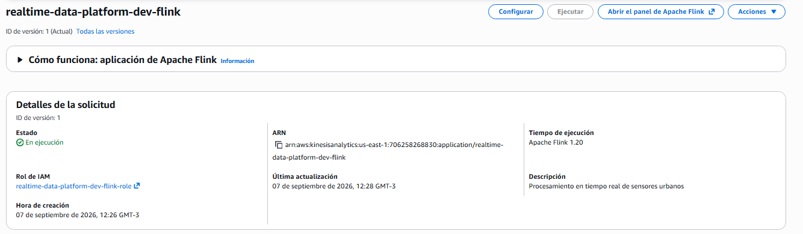
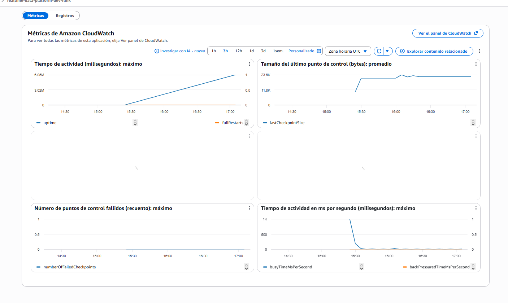
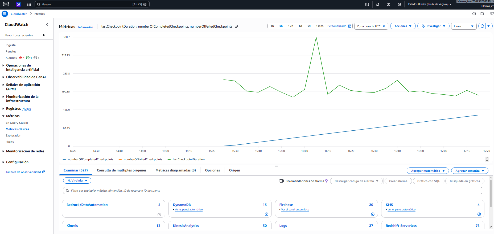
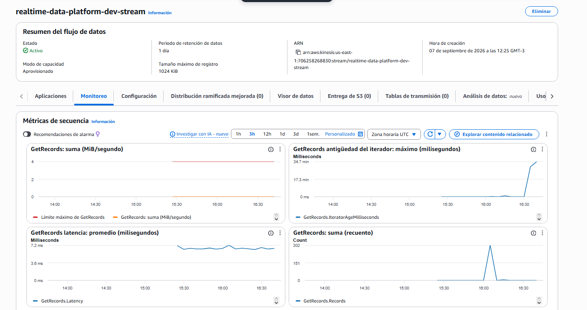
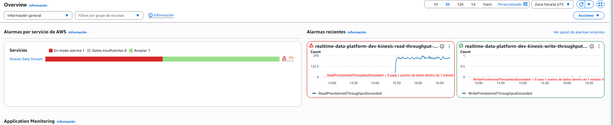
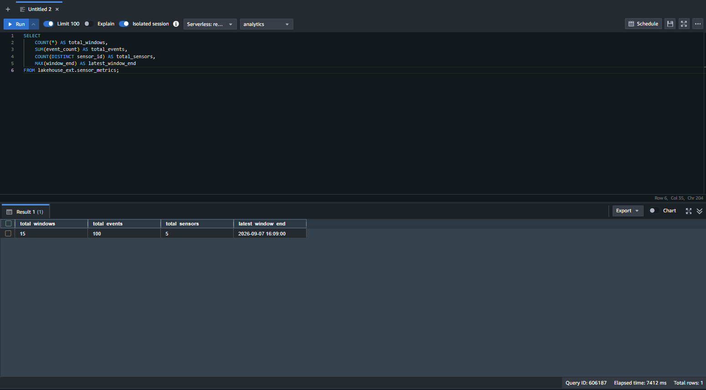
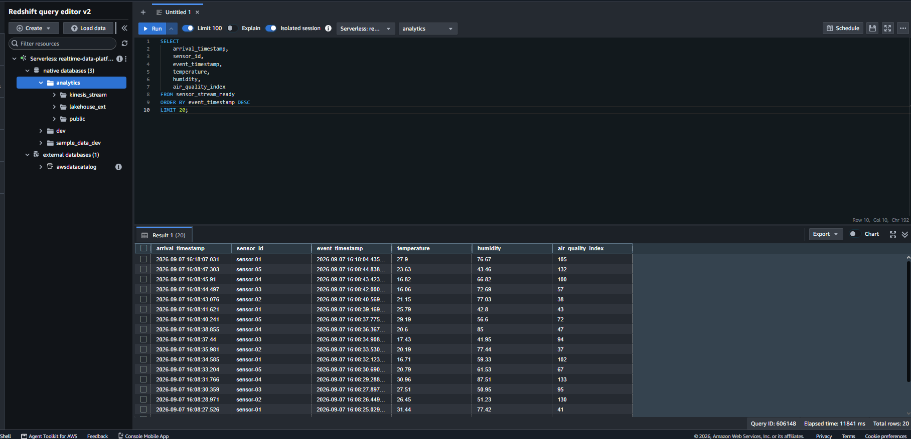

# Validación End-to-End Final

## Fecha

7 de septiembre de 2026

## Objetivo

Validar la plataforma de streaming completa desplegada mediante Terraform y comprobar que un mismo conjunto de eventos ingresado en Amazon Kinesis pueda ser consumido correctamente por los dos caminos principales de la arquitectura:

- **Hot path:** Producer -> Kinesis -> Amazon Redshift Serverless
- **Historical path:** Producer -> Kinesis -> Managed Service for Apache Flink -> Apache Iceberg -> Amazon S3 / AWS Glue

También se validaron observabilidad, checkpoints, lag de ingestión, comportamiento ante presión de lectura y consistencia entre ambos caminos.

---

## Arquitectura validada

```text
Synthetic Producer
        |
        v
Amazon Kinesis Data Streams
        |
        +------------------------------+
        |                              |
        v                              v
Managed Service for              Redshift Serverless
Apache Flink                     Streaming Ingestion
        |                              |
        v                              v
Apache Iceberg                  sensor_stream_raw
        |                              |
        v                              v
Amazon S3 / Glue               sensor_stream_typed
                                       |
                                       v
                              sensor_stream_ready
```

La aplicación Flink utiliza:

- Event Time
- Watermarks con tolerancia de 10 segundos
- Detección de fuentes idle
- Ventanas tumbling de 1 minuto
- Checkpoints periódicos
- Sink hacia Apache Iceberg

---

## Despliegue de infraestructura

La infraestructura completa fue desplegada desde Terraform.

Resultado del `terraform apply`:

- Recursos creados: **48**
- Recursos modificados: **0**
- Recursos destruidos: **0**

Estado observado durante la validación:

- Amazon Kinesis Data Stream: **ACTIVE**
- Amazon Redshift Serverless: **AVAILABLE**
- Managed Service for Apache Flink: **RUNNING**

La aplicación Flink fue iniciada automáticamente mediante Terraform, sin requerir un inicio manual posterior al despliegue.

### Evidencia



---

## Validación del camino hot

Se enviaron inicialmente **100 eventos sintéticos** correspondientes a **5 sensores**.

La ruta validada fue:

```text
Producer
  -> Kinesis
  -> Redshift Streaming Ingestion
  -> sensor_stream_raw
  -> sensor_stream_typed
  -> sensor_stream_ready
```

La materialized view `sensor_stream_raw` fue creada con:

```text
AUTO REFRESH YES
```

La propiedad `autorefresh` fue verificada como habilitada mediante `SVV_MV_INFO`.

Después del lote original se envió **1 evento técnico adicional** para avanzar el watermark de Flink y permitir el cierre de la última ventana histórica pendiente.

Por ese motivo, al final de la prueba Redshift contenía:

- Eventos hot totales: **101**
- Sensores: **5**
- Eventos del lote funcional original: **100**
- Evento técnico de avance de watermark: **1**

No fue necesario ejecutar manualmente `REFRESH MATERIALIZED VIEW` para incorporar los nuevos eventos.

### Evidencia



---

## Validación del camino histórico

Flink consumió los mismos eventos desde Kinesis y aplicó procesamiento mediante Event Time, Watermarks y ventanas tumbling de un minuto.

El lote original de 100 eventos produjo en Iceberg:

- Ventanas: **15**
- Eventos agregados: **100**
- Sensores distintos: **5**
- Última ventana cerrada: **2026-09-07 16:09:00**

La tabla histórica fue consultada desde Redshift mediante el External Schema:

```text
lakehouse_ext.sensor_metrics
```

La tabla corresponde al catálogo Glue:

```text
lakehouse_db.sensor_metrics
```

### Evidencia



---

## Event Time y avance del Watermark

Después de enviar los 100 eventos originales, Iceberg mostraba inicialmente:

- Ventanas cerradas: **10**
- Eventos agregados: **68**
- Sensores: **5**

Esto no representaba pérdida de datos.

Los eventos restantes pertenecían a una ventana de Event Time que todavía no había cerrado porque el productor había dejado de generar eventos y, por lo tanto, el watermark no había avanzado lo suficiente.

Se envió posteriormente un único evento adicional.

Después de avanzar el watermark:

- Ventanas: **15**
- Eventos del lote original: **100**
- Sensores: **5**

Esto permitió comprobar el comportamiento esperado de las ventanas basadas en Event Time.

---

## Consistencia entre hot path e historical path

La consistencia principal del lote original quedó verificada de la siguiente manera:

| Validación | Resultado |
|---|---:|
| Eventos originales enviados | 100 |
| Sensores originales | 5 |
| Eventos preservados en Iceberg | 100 |
| Sensores en Iceberg | 5 |
| Ventanas Iceberg | 15 |
| Sensores unidos hot + histórico | 5 |
| Filas omitidas por Redshift | 0 |

También se ejecutó un JOIN entre la información más reciente del camino hot y la última ventana histórica disponible por sensor.

Resultado:

- Sensores con JOIN correcto: **5 de 5**

No se observó pérdida de eventos del lote original.

---

## Observabilidad de Flink

Las métricas de CloudWatch verificadas durante la prueba mostraron:

- `numberOfCompletedCheckpoints`: **60**
- `numberOfFailedCheckpoints`: **0**
- `lastCheckpointDuration`: aproximadamente **210 ms**
- Duraciones habituales observadas: aproximadamente **180-230 ms**
- Pico aislado observado: aproximadamente **380 ms**

Los checkpoints continuaron completándose durante toda la ejecución.

Además, en las últimas dos horas de logs no se encontraron coincidencias reales para:

- `Exception in thread`
- `Caused by:`
- `Job execution failed`

La aplicación permaneció en estado:

```text
RUNNING
```

### Evidencia





---

## Observabilidad de Kinesis

Durante una medición en estado estable se observó:

```text
GetRecords.IteratorAgeMilliseconds = 0 ms
```

Posteriormente se observaron picos transitorios de Iterator Age:

- aproximadamente **2.390.000 ms**
- aproximadamente **2.700.000 ms**

Después de los picos, la métrica regresó nuevamente a:

```text
0 ms
```

Esto indicó recuperación del consumidor y ausencia de backlog permanente.

### Evidencia



---

## Saturación de lectura y backpressure

Durante la misma ventana temporal se observó la alarma:

```text
ReadProvisionedThroughputExceeded
```

Ejemplos registrados:

- 13:49 -> **218**
- 13:50 -> **221**
- 13:51 -> **210**
- 13:52 -> **222**

Al mismo tiempo se observó un incremento temporal de `IteratorAgeMilliseconds`.

La relación observada fue consistente con el siguiente escenario:

```text
Presión de lectura sobre Kinesis
        |
        v
ReadProvisionedThroughputExceeded
        |
        v
Aumento temporal de IteratorAge
        |
        v
Recuperación del consumidor
        |
        v
IteratorAge vuelve a 0
```

No se observó pérdida de integridad del lote original.

Durante el episodio:

- Flink permaneció `RUNNING`
- Failed checkpoints: **0**
- El lote original de **100 eventos** terminó preservado en Iceberg
- Redshift reportó **0 skipped rows**

La métrica `backPressuredTimeMsPerSecond` de Flink permaneció prácticamente en cero durante el período observado, por lo que la presión detectada se manifestó principalmente en la lectura de Kinesis y no como bloqueo sostenido del pipeline interno de Flink.

### Evidencia



---

## Observabilidad de Redshift

Se consultó `SYS_STREAM_SCAN_STATES` para analizar el comportamiento de Streaming Ingestion.

Resultado agregado:

- Registros escaneados: **101**
- Registros omitidos: **0**
- Máximo lag de ingestión observado: **23 segundos**

El lag máximo observado permaneció por debajo del objetivo operativo definido de 60 segundos.

El campo `arrival_timestamp` se propagó desde Streaming Ingestion hasta `sensor_stream_ready` y fue utilizado como evidencia de llegada de los eventos al camino hot.

---

## Recuperación de estado de Flink

El estado de Flink está protegido mediante checkpoints periódicos almacenados en S3.

Ante una falla de la aplicación o del runtime:

1. Flink identifica el último checkpoint válido.
2. Restaura el estado de operadores y ventanas.
3. Recupera las posiciones de lectura asociadas al source.
4. Continúa el procesamiento desde un estado consistente.

Durante esta validación:

- se completaron checkpoints continuamente,
- no se registraron checkpoints fallidos,
- no se observaron excepciones de ejecución,
- la aplicación permaneció `RUNNING`.

---

## Integridad y semántica de procesamiento

El lote funcional original estuvo compuesto por:

```text
100 eventos
5 sensores
```

El historical path produjo exactamente:

```text
100 eventos agregados
5 sensores
15 ventanas
```

El evento número 101 fue generado únicamente para avanzar el watermark después de detener el productor.

Por lo tanto, no debe interpretarse como parte del lote original utilizado para comparar la integridad entre Redshift e Iceberg.

No se observaron registros omitidos por Redshift:

```text
skipped_rows = 0
```

---

## Resultado final

La validación End-to-End final fue satisfactoria.

Se comprobó:

- despliegue completo mediante Terraform,
- Kinesis operativo,
- Managed Flink en ejecución,
- procesamiento mediante Event Time y Watermarks,
- checkpoints exitosos y recuperación de estado disponible,
- escritura histórica en Apache Iceberg,
- catálogo Glue disponible,
- Streaming Ingestion hacia Redshift,
- actualización automática de la materialized view,
- propagación de `arrival_timestamp`,
- consulta conjunta de datos hot e históricos,
- preservación de los 100 eventos originales,
- ausencia de filas omitidas,
- observabilidad mediante CloudWatch,
- recuperación de Iterator Age después de un episodio de throttling,
- y comportamiento consistente bajo presión temporal de lectura.

La plataforma quedó validada como un sistema de streaming End-to-End con rutas hot e historical independientes pero semánticamente consistentes.

---

## Evidencias finales

Archivos principales:

```text
docs/final-flink-running.png
docs/final-flink-checkpoints.png
docs/final-flink-monitoring.png
docs/final-kinesis-iterator-age-spike.png
docs/final-kinesis-throughput-alarm.png
docs/final-redshift-hot.png
docs/final-redshift-iceberg.png
```

---

## Limpieza

La infraestructura debe destruirse únicamente después de completar:

- documentación final,
- revisión del repositorio,
- generación del DAAT,
- y conservación de todas las evidencias necesarias.

Comando previsto:

```powershell
terraform "-chdir=terraform/environments/dev" destroy
```